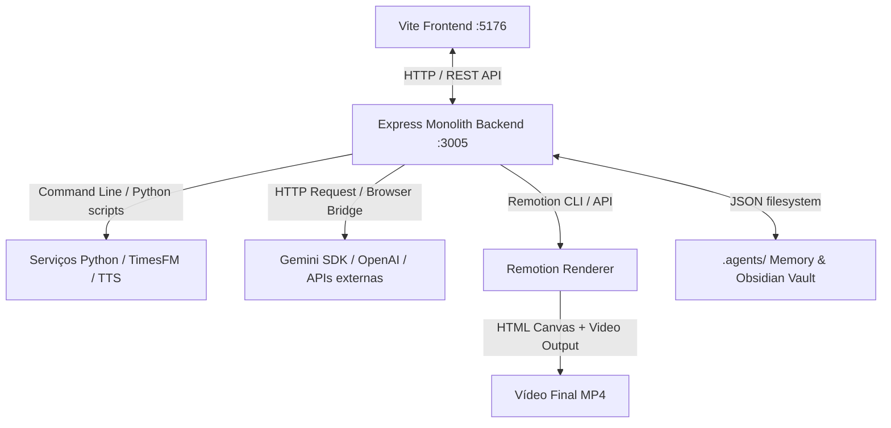

# Visão Geral da Arquitetura Lumiera

> 🔗 [[MEMORIA-LUMIERA]] · [[memory/lumiera-code-map]] · [[memory/videoagent-lumiera]]

O **Lumiera** é um ecossistema completo e automatizado para criação de vídeos de alta retenção (YouTube Shorts de 9:16 e vídeos Long-form de 16:9). Ele integra roteirização baseada em IA, geração de voz realista (TTS), curadoria de trilhas sonoras (BGM), geração de imagens e vídeos por difusão (ComfyUI / Seedance), overlays gráficos dinâmicos (HyperFrames) e publicação automatizada.

---

## 1. Arquitetura de Sistema (Componentes Principais)

O projeto é estruturado como um monorepo pragmático em que as responsabilidades são divididas em três camadas integradas:



### 1.1. Frontend (Vite + React)

- **Caminho:** [dashboard-qanat/frontend](file:///c:/Users/Leo/Documents/VIDEOS%20PROFISSIONAIS/LONGOS/LUMIERA/dashboard-qanat/frontend)
- **Porta padrão:** `5176`
- **Responsabilidade:** Dashboard administrativo completo (Dashmin) e editores visuais interativos.
- **Destaques:** Painel do **Creator** (criação e edição de roteiros), **Timeline Studio** (editor de faixas multitrilha para áudio, vídeo e overlays), **AgentReachPanel** (pesquisa web em 15 plataformas), e gerenciador de fila editorial do YouTube.

### 1.2. Backend (Express.js Monolith)

- **Caminho:** [dashboard-qanat/backend](file:///c:/Users/Leo/Documents/VIDEOS%20PROFISSIONAIS/LONGOS/LUMIERA/dashboard-qanat/backend)
- **Porta padrão:** `3005`
- **Responsabilidade:** Monólito de APIs e orquestrador de pipelines. Executa tarefas de sincronização de áudio, geração de prompts visuais, chamada de APIs de IA, e controle de subprocessos (Python, Remotion, FFmpeg).

### 1.3. Remotion Renderer

- **Caminho:** [dashboard-qanat/remotion-renderer](file:///c:/Users/Leo/Documents/VIDEOS%20PROFISSIONAIS/LONGOS/LUMIERA/dashboard-qanat/remotion-renderer)
- **Responsabilidade:** Motor de composição de vídeo determinístico baseado em React. Renderiza em tempo real na UI (com suporte a preview dinâmico) e gera arquivos de produção (MP4) usando a linha de comando do Remotion.
- **Abstração chave:** `LumieraTimeline.tsx` organiza e sobrepõe faixas de imagens/vídeos de estoque, narrações geradas por IA, música de fundo e overlays de texto/infográficos (**HyperFrames**).

---

## 2. Fluxo de Criação de Vídeo (Pipeline de Dados)

O ciclo de vida de geração de um vídeo no Lumiera segue um pipeline rígido com etapas de aprovação e refinamento:

```
1. Ideação & Nicho (TimesFM / TrendRadar)
     └── 2. Roteiro / Narração (Creator / ugc-scriptwriter)
           └── 3. Síntese de Voz (TTS: Kokoro/FishSpeech/GPT-SoVITS)
                 └── 4. Alinhamento de Áudio (timelineSpeechAlign / Whisper)
                       └── 5. Engenharia Visual & Prompts (visual-prompt-engineer)
                             └── 6. Orquestração de Overlays (HyperFrames / lower-third)
                                   └── 7. Renderização (Remotion Render CLI)
                                         └── 8. Publicação & SEO (Social Publisher / YouTube Studio)
```

1. **Nicho e Tendências:** O backend consome previsões temporais via `timesfmForecast.js` (TimesFM de Google Research) para classificar nichos emergentes e prever desempenho.
2. **Creator Tab:** O usuário cria ganchos (Hooks) e gera o roteiro narrativo (`narrative_script`) com IA usando as regras de UGC e retenção viral.
3. **TTS (Text-to-Speech):** O roteiro é enviado para sintetizadores de voz locais ou remotos (como Kokoro TTS ou FishSpeech) que retornam arquivos de áudio WAV para cada bloco.
4. **Sincronização de Legendas e Timings:** O motor alinha o texto falado ao áudio para gerar tempos precisos por palavra.
5. **Composição Visual (Engenharia de Prompts Visuais):** O roteiro é enriquecido com prompts visuais detalhados gerados por IA para guiar o motor de stock ou renderizadores 3D (Blender/Cesium).
6. **Inserção de Overlays (HyperFrames):** Estatísticas, timelines, contadores e terços inferiores são orquestrados em faixas paralelas por `overlayOrchestration.js` sem sobrepor legendas.
7. **Renderização Fina:** O Remotion renderiza o vídeo final mesclando as pistas de mídia, aplicando trilha sonora do Epidemic Sound e aplicando efeitos.

---

## 3. Principais Integrações & APIs

O Lumiera possui conectores com diversas tecnologias de IA, design e distribuição:

- **Provedores de LLM:** Gemini API (nativo por meio de requisições HTTP diretas e com fallback/integração via extensão Gemini Browser Bridge) e OpenAI/OpenRouter para tarefas de agente.
- **Motores TTS (Text-to-Speech):**
  - _Kokoro TTS:_ Vozes extremamente expressivas geradas localmente.
  - _FishSpeech & GPT-SoVITS:_ Suporte a clonagem e alta fidelidade.
  - _Chatterbox:_ Pipeline alternativo de processamento de áudio.
- **Epidemic Sound API:** Busca semântica e download automático de trilhas sonoras livres de direitos autorais, ajustando dinamicamente o volume de fundo (sonoplastia e mixagem automática).
- **Canva API:** Geração de thumbnails com alta taxa de clique (CTR) por meio de templates automatizados.
- **CesiumJS & Satellite Map:** Criação de introduções baseadas em localização geográfica (Geo-Location Intro) com mapas 3D hiperrealistas e voos de câmera cinemáticos.
- **ComfyUI MCP & Seedance:** Geração local e em nuvem de arte visual e vídeos sintéticos orientados pelas instruções do storyboard.
- **TimesFM (Google Research):** Modelo de séries temporais de IA para detecção de tendências de busca e radar de nichos de alto RPM.

---

## 4. Sistema de Memória Procedural e Agents

A inteligência dos agentes do Lumiera é enriquecida dinamicamente através da leitura de arquivos no Obsidian Vault localizados em `.agents/`.

- **Hub Principal:** `MEMORIA-LUMIERA.md` é a raiz do grafo de conhecimento.
- **Injeção de Contexto:** Ao iniciar prompts de roteiro ou overlays, o Lumiera executa a função `injectStudioAgentsContext()` em [skillsRegistry.js](file:///c:/Users/Leo/Documents/VIDEOS%20PROFISSIONAIS/LONGOS/LUMIERA/dashboard-qanat/backend/skillsRegistry.js) para concatenar:
  - As regras de formatação ativa da pasta `.agents/skills/`.
  - Os aprendizados históricos acumulados pelo `agentMemory.js`.
  - O mapeamento compacto do código (`lumieraCodeMap.js`).
- **Aprendizado Contínuo:** Erros detectados e soluções criativas são salvos de forma procedural na memória para evitar que o agente cometa os mesmos erros em sessões futuras.
