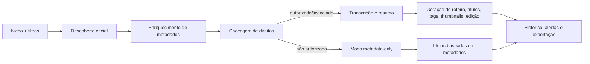
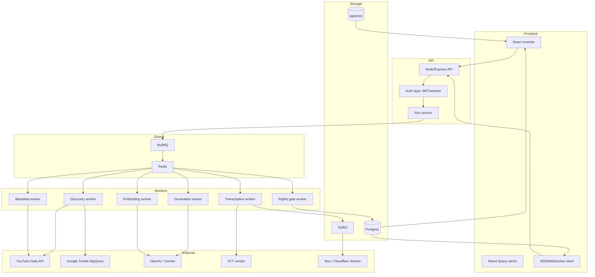
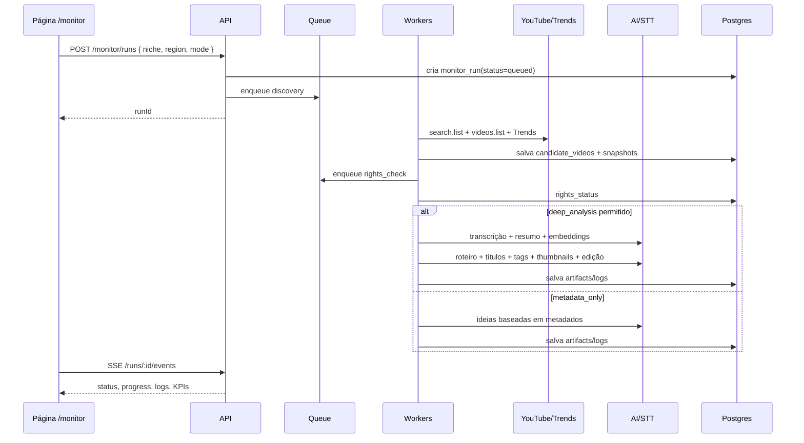

# Pesquisa profunda para uma página única de monitoramento e automação de criação de vídeos em React

## Resumo executivo

Pelo que aparece no post original e em reproduções/resumos do fio, o processo do tweet do `@monokern` é, em essência, um pipeline de pesquisa e empacotamento: escolher um tema, encontrar um conjunto pequeno de vídeos relevantes do nicho, consolidar sinais e contexto, transformar isso em notas estruturadas e, a partir daí, gerar artefatos de criação com apoio de IA. No próprio resumo do fluxo, o autor descreve uma rotina centrada em coletar cerca de 10 vídeos por tópico e reduzir o trabalho manual de pesquisa para poucos minutos depois da configuração inicial. Hoje, o produto NotebookLM do Google passou a se chamar **Gemini Notebook**, o que é relevante se você quiser “espelhar” a lógica do tweet, mas com stack própria e mais controlável em produção. citeturn0search0turn2search1turn31search3turn31search5

Para o seu app React, a melhor adaptação não é “copiar ferramentas”, e sim **converter o processo em uma esteira observável**: uma página única de “mission control” com filtros por nicho, execução de jobs, amostragem de vídeos candidatos, logs por etapa, histórico de execuções, alertas e geração de entregáveis. Em termos de produto, isso significa ter no mesmo lugar: descoberta de vídeos em alta, enriquecimento de metadados, transcrição, resumo, geração de roteiro similar, sugestões de títulos/tags/thumbnails e ideias de edição. A arquitetura recomendada combina **descoberta oficial** com APIs do YouTube e Google Trends, **orquestração de jobs** com Redis/BullMQ, **persistência relacional + vetorial** com Postgres/pgvector, e **processamento multimídia** com FFmpeg. citeturn26view0turn26view1turn32view0turn25search1turn25search0turn24search0turn24search1

A recomendação central deste relatório é adotar um modo **compliance-first**. Isso muda decisões importantes. O YouTube permite descoberta e metadados públicos via API, mas as políticas para clientes da YouTube API proíbem baixar, importar, fazer backup, cachear ou armazenar cópias de conteúdo audiovisual sem aprovação prévia por escrito; além disso, restringem armazenamento de dados não autorizados por mais de 30 dias e também proíbem usar YouTube API Data para criar métricas derivadas como um “trend score” puramente calculado a partir desses dados. Em outras palavras: para um produto robusto e auditável, você deve separar claramente **descoberta pública** de **análise profunda de conteúdo**. A análise profunda deve ser liberada apenas para vídeos próprios, licenciados, Creative Commons ou com autorização explícita. citeturn23view0turn22view0turn21search22turn21search21

A boa notícia é que isso **não inviabiliza** o produto; apenas muda a fronteira entre o que é público, o que é privado e o que exige direitos confirmados. Na prática, a melhor stack para a versão inicial é: **YouTube Data API + Google Trends dataset** para descoberta; **OpenAI ou Gemini** para roteiro/títulos/resumos; **OpenAI, Google Cloud Speech-to-Text, AssemblyAI ou Deepgram** para transcrição; **pgvector** para similaridade semântica; e **Mux ou Cloudflare Stream** para ingest, playback e hospedagem dos vídeos que forem seus ou licenciados. citeturn38view0turn32view0turn30view2turn17view0turn29view3turn35view0turn34view0turn25search0turn27view0turn27view2turn28search1turn28search3

## Processo-base do tweet e como traduzi-lo para produto

O fio do tweet, conforme os resumos disponíveis, descreve um processo “pesquisa → consolidação → geração” muito próximo de um **RAG orientado a creator workflow**: você coleta um pacote de referências, usa uma camada de análise para entender estrutura/padrões e salva tudo em arquivos reutilizáveis. O ponto forte do modelo não é apenas “achar vídeos”, mas transformar esse material em um **repositório utilizável de conhecimento e prompts** para futuras peças. Isso combina muito bem com um app React desde que a execução seja tratada como uma série de jobs observáveis, e não como um único clique “mágico”. citeturn0search0turn2search1turn2search3

A tradução mais produtiva para seu app é dividir a automação em **sete estágios de execução**, todos visíveis na mesma página:

1. seleção do nicho e parâmetros de busca;  
2. descoberta e coleta de candidatos;  
3. enriquecimento de metadados e priors de tendência;  
4. checagem de direitos/licença;  
5. transcrição e resumo;  
6. geração de assets editoriais;  
7. publicação do pacote final no histórico do projeto.

Essa separação é importante porque ela permite que a interface mostre **progresso, falhas, custos e latência** por etapa, e não apenas um resultado final opaco. Além disso, ela facilita retries, cache, paralelismo e auditoria. O BullMQ foi desenhado justamente para filas resilientes em Node.js com retries, backoff e inspeção de jobs; Redis também é um encaixe natural quando você precisa de logs/eventos em tempo real e consumo por grupos de workers. citeturn25search1turn25search4turn25search2turn25search14

A página única deve funcionar como um painel de comando, não como um wizard. Isso significa evitar múltiplas rotas de formulário. Em vez disso, concentre tudo em um único endpoint de UI, por exemplo `/monitor`, com drawers e painéis laterais para detalhes. Assim, você preserva o requisito de “uma página só” e ainda consegue suportar cenários reais: um job em andamento, outro concluído, logs fluindo, o usuário comparando dois vídeos e, ao mesmo tempo, aprovando um roteiro sugerido. Essa abordagem é especialmente forte quando combinada com **SSE** ou WebSocket para eventos de progresso e `react-query` para buscas idempotentes de estado consolidado.

O fluxo recomendado fica assim:



Para quem quiser seguir o “espírito” do tweet sem depender de wrappers não oficiais, a equivalência conceitual seria: **Gemini Notebook/NotebookLM como referência de UX mental**, mas **orquestração própria** no backend, com resultados estruturados em banco e arquivos Markdown/JSON exportáveis. O produto do Google continua existindo como ferramenta de pesquisa, mas o valor do seu app estará em transformar isso em automação rastreável, com regras, custos, permissões, histórico e integrações reais. citeturn31search3turn31search5

## APIs e serviços para descoberta, tendências, metadados e streaming

A base de descoberta mais segura hoje é o **YouTube Data API v3**. Ele oferece `search.list` para busca por query e `videos.list` com `chart=mostPopular` para listar os vídeos mais populares por região e categoria. O endpoint `search.list` retorna coleção de resultados, aceita ordenação, datas e filtros; o `videos.list` com `mostPopular` é particularmente útil para capturar “o que está pegando” por país/categoria. O overview atual da API também indica a política de quotas padrão: 100 chamadas `search.list`, 100 `videos.insert` e 10.000 unidades por dia para os demais endpoints, sujeito a mudança. citeturn26view0turn26view1turn38view0

Para tendências fora do recorte estritamente “top vídeos”, o **Google Trends dataset no BigQuery** é uma alavanca excelente. O dataset oficial traz consultas Top 25 e Rising, com escopo internacional e dos EUA, e oferece janela histórica diária e, no caso do dataset dos EUA, uma janela horária adicional. Isso ajuda muito no problema real de creators: um vídeo “subindo” raramente nasce apenas de dentro do YouTube; muitas vezes ele acompanha um tema em crescimento no Google mais amplo. A integração mais inteligente é usar o Google Trends como **sinal exógeno**, e o YouTube como **sinal endógeno**. citeturn32view0

No ecossistema TikTok, é importante separar duas coisas. A **Display API** oficial serve para exibir os vídeos e o perfil de um criador autorizado e oferece endpoints como `/v2/video/list/` e `/v2/video/query/`. Já a **Research API/Research Tools** é restrita a pesquisadores qualificados em bases não lucrativas; a documentação diz explicitamente que, no Brasil, o acesso é voltado a instituições acadêmicas ou organizações sem fins lucrativos pesquisando segurança online juvenil. Portanto, para um produto comercial generalista de creators, a Research API tende a **não ser uma base operacional viável**; a Display API pode entrar, mas para exibição e ingest autorizada da conta do criador, não para descoberta pública ampla. citeturn40search1turn40search3turn40search5turn40search0turn40search4turn40search11

Para os seus **vídeos próprios ou licenciados**, faz muito mais sentido usar uma plataforma de vídeo controlada por você. Aqui, **Mux** e **Cloudflare Stream** são as duas melhores candidatas com documentação pública forte. O Mux tem bom equilíbrio entre ingest, player, analytics, captions e automações “robots” como sumarização, key moments e chapter generation; o Cloudflare Stream simplifica muito upload, encode, store e delivery numa API única, com preços agressivos e integração direta com Signed URLs e edge delivery. O Cloudflare Stream documenta gravação a US$ 5 por 1.000 minutos e entrega a US$ 1 por 1.000 minutos; o Mux documenta armazenamento a partir de US$ 0,0024/min, entrega a partir de US$ 0,0008/min e ainda expõe recursos adicionais como on-demand captions, key moments e sumarização. citeturn27view0turn27view2turn28search1turn28search3turn28search7

A tabela abaixo resume as principais opções que fazem sentido para o seu caso.

| Serviço/API | Uso recomendado | Dados disponíveis | Preço/limite relevante | PT-BR | Trade-off principal |
|---|---|---|---|---|---|
| YouTube Data API v3 | Descoberta inicial por nicho, metadados públicos, ranking por `mostPopular` | busca, snippets, estatísticas, categorias, player data citeturn26view0turn26view1 | quota padrão: 100 `search.list`, 100 `videos.insert`, 10.000 unidades/dia para outros endpoints citeturn38view0 | Sim, docs em pt-BR e locale suportado citeturn38view0turn26view1 | Melhor base oficial; mas não entrega download de audiovisual e impõe regras rigorosas de armazenamento/uso citeturn23view0 |
| YouTube Analytics API | Dados do seu canal ou content owner autenticado | relatórios por canal/content owner, métricas/dimensões e filtros citeturn22view1 | armazenamento pode exceder 30 dias com autorização, mas precisa revalidar autorização periodicamente citeturn22view0 | Sem problema para PT-BR no app | Excelente para comparar “vídeo em alta do nicho” vs “fit com seu canal”, mas só para dados de quem autorizou |
| Google Trends dataset em BigQuery | Sinal macro de tendência e rising queries | Top 25 overall + Top 25 rising, escopo US e internacional, janela histórica citeturn32view0 | BigQuery free tier: até 1 TB/mês em queries e 10 GB/mês em storage sem cobrança citeturn32view0 | Sim, interface/ajuda em português disponível citeturn19search3turn32view0 | Ótimo como sinal complementar; não é um “catálogo de vídeos” |
| TikTok Display API | Exibir/importar dados do próprio criador autorizado | `/v2/user/info/`, `/v2/video/list/`, `/v2/video/query/` citeturn40search1turn40search5turn40search9 | requer OAuth e scopes `user.info.basic` + `video.list` citeturn40search3 | Não documenta “PT-BR” como diferencial, mas funciona por app/global | Boa para contas conectadas; não resolve descoberta pública em grande escala |
| TikTok Research Tools | Pesquisa acadêmica/não lucrativa | dados públicos de contas e conteúdo para pesquisa citeturn40search0turn40search10 | elegibilidade restrita; no Brasil, foco em acadêmicos / ONGs e youth safety citeturn40search0 | N/A | Muito forte em pesquisa, fraco como base comercial generalista |
| Mux | Hospedagem/streaming de vídeos próprios, player, analytics, AI helpers | upload, encode, storage, delivery, captions, player, analytics citeturn27view0 | storage desde US$ 0,0024/min; delivery desde US$ 0,0008/min; captions e robots com preços por job/minuto citeturn27view0 | Sem fricção para servir PT-BR | Mais completo para produto de creator; custo cresce conforme delivery e features |
| Cloudflare Stream | Hospedagem/streaming simples e barato para vídeos próprios | upload, transcode, store, deliver, signed URLs, analytics básicos citeturn27view2turn28search7 | US$ 5/1.000 min gravados e US$ 1/1.000 min entregues citeturn28search3turn28search13 | Sem fricção para servir PT-BR | Excelente custo e simplicidade; menos “creator workflows” prontos que o Mux |

A conclusão prática é esta: para a sua funcionalidade principal — **achar vídeos populares em alta por nicho** — o caminho mais sólido é combinar **YouTube Data API + Google Trends dataset**. Para a camada de playback/download, use **Mux ou Cloudflare Stream** quando o vídeo for seu ou licenciado. Para vídeos de terceiros, use **embed/streaming oficial**; não use download em produção se quiser manter alinhamento com as políticas do YouTube. citeturn26view0turn26view1turn32view0turn23view0

## Arquitetura da página única, do backend e dos fluxos de dados

No frontend, a recomendação é uma rota única `/monitor` com layout em quatro faixas visuais: **topbar de filtros**, **KPIs**, **tabela/lista de runs e vídeos**, e **painel lateral de detalhes**. Em vez de espalhar telas, a página usa drawers, tabs e modais leves. Isso preserva o requisito de página única e, ao mesmo tempo, suporta uma UX profissional. O estado deve ser separado em três camadas: estado de servidor consultado via `react-query`, estado efêmero de UI via Zustand/Context e stream de eventos de job via SSE. O motivo é simples: descoberta, histórico e KPIs pedem cache e revalidação; seleção de linha/filtros pede estado local; logs/progresso pedem atualização incremental.

Os componentes React que mais fazem sentido são:

- `NicheFiltersBar`
- `MonitorKpis`
- `RunsTable`
- `CandidateVideosGrid`
- `RunTimeline`
- `VideoInsightDrawer`
- `ArtifactsPanel`
- `LogsConsole`
- `QuotaAndAlertsBar`

Os hooks principais seriam `useMonitorFilters`, `useRuns`, `useRunEvents`, `useCandidateVideos`, `useGenerateArtifacts` e `useQuotaStatus`. A rota única pode usar query string para deep-linking, por exemplo `?runId=abc&videoId=xyz&tab=artifacts`.

No backend, o desenho mais seguro é **API síncrona curta + fila assíncrona longa**. Seus endpoints HTTP apenas validam entrada, abrem um run, enfileiram jobs e leem estado consolidado; o trabalho pesado vai para workers. O BullMQ é adequado para isso porque já cobre prioridades, retries exponenciais, jobs encadeados e inspeção. Para armazenamento, use **Postgres** para entidades transacionais e **pgvector** para embeddings e similaridade semântica. Para blobs e mídia intermediária, use **S3/R2**; para processamento multimídia local ou em worker separado, use FFmpeg. citeturn25search1turn25search4turn25search0turn24search0turn24search1

O esquema lógico mínimo no banco pode ser:

- `users`
- `projects`
- `niches`
- `monitor_runs`
- `candidate_videos`
- `video_snapshots`
- `transcripts`
- `summaries`
- `generated_artifacts`
- `run_logs`
- `alerts`
- `embeddings`

A entidade mais importante é `monitor_runs`. Ela deve ter `status`, `mode` (`metadata_only` ou `deep_analysis`), `rights_status`, `cost_estimate`, `started_at`, `ended_at`, `error_count`, `source_mix` e `niche_id`. Isso permite observabilidade real da esteira.

A arquitetura recomendada fica assim:



Os endpoints principais devem cobrir cinco grupos: runs, discovery, artifacts, logs e alerts. Um conjunto inicial bem equilibrado seria:

- `POST /api/monitor/runs`
- `GET /api/monitor/runs`
- `GET /api/monitor/runs/:id`
- `GET /api/monitor/runs/:id/events`
- `GET /api/monitor/runs/:id/logs`
- `POST /api/discovery/videos`
- `POST /api/videos/:id/generate`
- `POST /api/videos/:id/transcribe`
- `POST /api/videos/:id/reanalyze`
- `GET /api/alerts`
- `POST /api/alerts/test`

A UX da página deve expor **KPIs operacionais** e **KPIs editoriais** lado a lado. Os KPIs operacionais são: runs ativas, latência média por etapa, custo estimado da execução, falhas por serviço, quota restante e backlog de jobs. Os KPIs editoriais são: vídeos candidatos encontrados, nº de vídeos aprovados para análise profunda, títulos gerados, scripts aprovados e nº de insights novos por nicho. Quando a descoberta estiver em modo estritamente oficial, mostre apenas métricas brutas e classificações qualitativas; quando o conteúdo for próprio/licenciado, você pode liberar análise mais profunda e artefatos derivados.

Um fluxo de dados realista fica assim:



## IA, ML, modelos recomendados e custos estimados

O que você quer construir pede cinco blocos distintos de IA/ML: **detecção de tendências**, **transcrição**, **resumo/roteiro**, **similaridade semântica** e **ideação visual/editorial**. A principal recomendação aqui é não tentar resolver tudo com um único modelo. O melhor desenho de custo/latência normalmente usa **um modelo barato e rápido para volume**, **um modelo melhor para refino** e **um embedding model separado** para clustering e similaridade.

Para **detecção de tendências**, a melhor arquitetura é um ranker híbrido, não um LLM puro. Use features como recência, crescimento de views entre snapshots, comentários por hora, densidade de temas relacionados no Google Trends, diversidade de canais e distância semântica entre vídeos do mesmo nicho. O resultado não precisa ser exibido como “métrica do YouTube”; ele pode ser usado internamente para priorização de fila. Se você optar por exibir um score ao usuário, prefira construir esse score com sinais próprios e do Google Trends, ou com dados do próprio canal autenticado, para reduzir risco de conflito com as políticas da YouTube API. citeturn23view0turn22view0turn32view0

Para **similaridade de conteúdo**, o caminho mais direto é embeddings + pgvector. O `text-embedding-3-large` é o embedding mais capaz da OpenAI e custa US$ 0,13 por 1 milhão de tokens; o `text-embedding-3-small` custa US$ 0,02 por 1 milhão de tokens e já é excelente para clustering, recall e busca vetorial. A OpenAI descreve os embeddings como vetores cujo distanciamento mede relatedness, e o pgvector adiciona busca exata ou aproximada diretamente no Postgres. O Gemini também oferece embeddings com o modelo `gemini-embedding-001` a US$ 0,15 por 1 milhão de tokens, além de batch a metade do preço. citeturn18search2turn18search0turn18search3turn25search0turn33search0turn33search4

Para **transcrição**, as melhores opções hoje, considerando preço, suporte multilíngue e aptidão para PT-BR, são estas:

| Serviço/modelo | Perfil ideal | Preço oficial | Latência/forma | PT-BR |
|---|---|---|---|---|
| OpenAI `gpt-4o-mini-transcribe` | menor custo por arquivo, boa qualidade geral | ~US$ 0,003/min citeturn17view0 | request/response; a própria OpenAI indica usar quando custo importa mais que topo de precisão citeturn36search1turn36search2 | Sim, via suporte multilíngue/Whisper lineage citeturn30view1turn30view2 |
| OpenAI `gpt-4o-transcribe` | qualidade maior em arquivo | ~US$ 0,006/min citeturn17view0 | request/response citeturn36search1turn36search2 | Sim, multilíngue citeturn30view2turn30view1 |
| OpenAI `gpt-realtime-whisper` | live captions / monitor em tempo real | US$ 0,017/min citeturn17view0turn36search0 | streaming baixo atraso; a documentação fala em latência controlável e o cookbook oficial cita ~300–800 ms típicos citeturn36search1turn36search3turn36search10 | Sim, pela família Whisper multilíngue citeturn30view1 |
| Google Cloud STT V2 | custo baixo, boa governança enterprise | US$ 0,003/min no dynamic batch standard citeturn29view3 | batch e streaming em tempo real; Google recomenda frames de 100 ms como bom trade-off citeturn12search5turn12search21 | Sim, PT-BR oficialmente listado com `chirp_3`, `long`, `short`, `telephony` e diarização em regiões específicas citeturn37view0turn37view1 |
| AssemblyAI Universal-3.5 Pro | ótima escolha para Voice AI e diarização | US$ 0,21/h em batch; US$ 0,45/h realtime citeturn35view0 | Sync API em ~134 ms p50 para clipes curtos; realtime disponível citeturn35view0 | Sim, português explicitamente suportado citeturn29view5turn35view0 |
| Deepgram Nova-3 Multilingual | forte em baixa latência e customização de vocabulário | US$ 0,0058/min streaming e US$ 0,0092/h? / US$ 0,0078? A página separa rates por modo e tier; para batch/streaming multilingual, as tabelas listam PAYG/Growth específicos citeturn34view0 | vendor enfatiza ultra-low latency e auto language detection citeturn29view1turn34view0 | Sim, português listado no suporte multilíngue citeturn14search1turn29view1 |

Minha recomendação objetiva para o seu caso é: **OpenAI `gpt-4o-mini-transcribe` ou Google STT V2** para volume e custo; **AssemblyAI** se você valoriza muito diarização/tempo real/Voice AI; e **Deepgram** se seu produto evoluir rapidamente para live pipelines. Para vídeos de nicho analisados em lote, o Google STT V2 e o `gpt-4o-mini-transcribe` são as combinações mais econômicas entre as opções com documentação de preço pública clara. citeturn17view0turn29view3turn35view0

Para **roteiro, títulos, tags, resumos e ideias de edição**, você quer dois perfis de modelo: um “barato para escala” e um “forte para segunda passada”. Hoje, o catálogo da OpenAI coloca o GPT‑5.6 Terra como meio-termo de custo/inteligência e o GPT‑5.6 Luna como opção econômica para volume; a própria página de modelos afirma que os modelos mais recentes têm capacidades multilíngues. No ecossistema Google, o Gemini 2.5 Pro segue como opção forte para raciocínio/código, enquanto a tabela de pricing mostra modelos Flash com custo bem mais baixo para alto throughput. citeturn30view2turn17view0turn16view0

| Tarefa | Recomendação principal | Alternativa | Custo oficial | Observação |
|---|---|---|---|---|
| Resumo curto e cluster labeling | GPT‑5.6 Luna citeturn30view2turn17view0 | Gemini 3 Flash / Flash Lite citeturn16view0 | Luna: US$ 1/M input + US$ 6/M output citeturn17view0 | Melhor custo para alto volume |
| Roteiro similar e ideias de edição | GPT‑5.6 Terra citeturn30view2turn17view0 | Gemini 2.5 Pro citeturn16view0 | Terra: US$ 2,50/M input + US$ 15/M output citeturn17view0 | Boa qualidade/custo |
| Similaridade semântica | `text-embedding-3-small` ou `3-large` citeturn18search0turn18search3 | `gemini-embedding-001` citeturn33search0turn33search4 | OpenAI: US$ 0,02/M ou US$ 0,13/M tokens citeturn18search0turn18search3 | Embedding sai quase gratuito perto de LLM |
| Thumbnail generation opcional | Gemini 3.1 Flash Lite Image citeturn16view0 | OpenAI GPT Image 1 Mini/2 citeturn17view0 | Google: ~US$ 0,0336 por imagem 1K citeturn16view0 | Para thumbnail, eu sugiro começar com “brief de thumbnail” antes de gerar imagem |
| Explicações de tendência em PT-BR | GPT‑5.6 Terra ou Luna citeturn30view2turn17view0 | Gemini 3 Flash citeturn16view0 | conforme tokenização citeturn17view0turn16view0 | Excelente para gerar rationale textual do nicho |

Um orçamento simples ajuda a dimensionar o MVP. Suponha uma execução com **10 vídeos de 8 minutos cada**, totalizando **80 minutos de áudio**. A transcrição com `gpt-4o-mini-transcribe` sai por cerca de **US$ 0,24**; com Google STT V2 dynamic batch, também cerca de **US$ 0,24**; com AssemblyAI Universal‑3.5 Pro batch, cerca de **US$ 0,28**. Se você rodar uma segunda etapa de geração com GPT‑5.6 Luna, assumindo algo como 35k tokens de entrada e 3k de saída por vídeo, o custo fica na ordem de **US$ 0,053 por vídeo**, ou **~US$ 0,53 para os 10 vídeos**. Embeddings para todos os resumos/transcrições custariam centavos de dólar. citeturn17view0turn29view3turn35view0turn18search3

Na prática, isso significa que o seu custo variável por run, em modo batch e sem geração de imagem, pode ficar **abaixo de US$ 1** em cenários econômicos, e subir para **US$ 2–4** quando você usar modelos mais fortes, mais texto de contexto, mais retries e geração visual. Esse patamar é bom o suficiente para o produto começar pequeno, desde que você coloque **limites por workspace, cotas por usuário e aprovação humana** antes de gerar todos os artefatos automaticamente.

## Considerações legais, éticas e operacionais

Aqui está o ponto mais importante do relatório: se você usar a **YouTube API** como sua base oficial, precisa projetar o produto em volta das políticas dela, não contra elas. A política de desenvolvedores afirma que clientes não devem baixar, importar, fazer backup, cachear ou armazenar cópias de conteúdo audiovisual do YouTube sem aprovação prévia por escrito, nem usar a API para facilitar infração de copyright. A mesma política limita retenção de dados não autorizados a 30 dias, exige refresh ou deleção, e determina que o app deve oferecer mecanismo de exclusão de dados do usuário. citeturn23view0turn22view0

Isso produz uma consequência arquitetural direta: o seu app deve ter um **rights gate** obrigatório. Antes de liberar transcrição, resumo profundo, geração de roteiro similar ou download/streaming próprio, o backend precisa marcar o item como um destes estados:

- `owned`
- `licensed`
- `creative_commons`
- `authorized_third_party`
- `public_metadata_only`
- `blocked`

Se o vídeo estiver em `public_metadata_only`, a pipeline deve parar depois de descoberta/metadados e gerar apenas insights editoriais de alto nível, sem transcrição do audiovisual nem download do arquivo. Esse controle não é “burocracia”; ele é a diferença entre um produto comercialmente vendável e um protótipo frágil.

Na frente de copyright, o YouTube lembra que “fair use” é uma doutrina do direito dos EUA e que a decisão final depende dos fatos do caso; além disso, a própria central do YouTube alerta que usar apenas “alguns segundos” de material protegido ainda pode gerar problema. O Brasil não tem uma cláusula geral de fair use equivalente; a Lei 9.610/1998 regula direitos autorais e trabalha com limitações e exceções específicas, não com um passe livre geral para “conteúdo transformado”. Portanto, “vídeo similar” deve significar **similar em estrutura, gancho, pacing, tópicos e engenharia narrativa**, e não uma adaptação próxima de trechos protegidos, falas ou assets visuais de terceiros. citeturn21search0turn21search3turn21search21turn20search0

Há também um detalhe pouco comentado, mas muito sério: a política do YouTube diz que um cliente não deve usar YouTube API Data para criar dados ou métricas derivadas. Para uma postura estritamente conservadora, isso inviabiliza exibir um “score proprietário de tendência” calculado diretamente a partir das estatísticas da API. Por isso, a estratégia mais segura é manter o YouTube como fonte de **dados brutos de descoberta** e usar sinais independentes — por exemplo, Google Trends, dados do canal autenticado, histórico próprio de snapshots, feedback editorial humano — para construir priorizações internas. Se você quiser exibir um score de produto, descreva-o como um **score interno do workspace**, não como “métrica do YouTube”, e mantenha revisão jurídica se esse score combinar intensamente dados da plataforma. citeturn23view0

No campo ético, vale adotar quatro controles desde o começo:

Primeiro, **transparência de fonte**. Todo insight deveria dizer de onde veio: YouTube oficial, Google Trends, canal próprio, vídeo licenciado, ou sugestão inferida por IA.

Segundo, **evitar clonagem**. O objetivo deve ser “inspirar novos vídeos” e não “copiar o que já funcionou”. Isso pode ser codificado no prompt e nas regras de pós-processamento, exigindo mudança de framing, exemplos, CTA e ordem argumentativa.

Terceiro, **minimização de dados**. Guarde só o necessário e apague/refresh dentro das janelas contratuais.

Quarto, **rate limiting e kill switches**. Se quota cair, se o provedor devolver erros, ou se um conector mudar contrato, a pipeline deve cair para modo degradado em vez de insistir em scraping improvisado.

## Plano de implementação e boilerplates prontos para integrar

A melhor cadência de entrega para esse produto é em quatro fases. O ponto chave é não tentar resolver “descoberta + transcrição + geração + streaming + publicação” de uma vez. O maior risco não é técnico; é de escopo e compliance.

| Fase | Entrega | Prioridade | Esforço estimado |
|---|---|---|---|
| Foundation | página `/monitor`, auth, criação de `monitor_runs`, filas, logs, KPIs básicos | Muito alta | 4–6 dias |
| Discovery | YouTube Data API + Google Trends, filtros por nicho/região/período, histórico de candidatos | Muito alta | 5–7 dias |
| AI editorial | resumo, roteiro similar, títulos, tags, brief de thumbnail, ideias de edição, embeddings | Alta | 6–10 dias |
| Rights + mídia própria | rights gate, modo metadata-only, upload/streaming em Mux ou Cloudflare, exportações | Alta | 5–8 dias |
| Refinos | alertas, comparação entre runs, clustering por subtema, custo/quota forecasting | Média | 4–7 dias |

### Arquitetura de implementação recomendada

Para o MVP funcional, eu recomendo o seguinte recorte técnico:

- **Frontend:** React + React Router + TanStack Query + Zustand
- **Backend:** Node + Express
- **Fila:** BullMQ + Redis
- **Banco:** Postgres + pgvector
- **Storage:** S3 ou Cloudflare R2
- **Processamento de vídeo:** FFmpeg
- **IA:** OpenAI para texto/embeddings; Google STT ou OpenAI mini-transcribe para batch econômico
- **Streaming próprio:** Cloudflare Stream se custo for prioridade; Mux se você quiser um pacote mais “video platform”

### Exemplo de página React

O componente abaixo entrega a espinha dorsal da página única: filtros, KPIs, runs, candidatos e logs em tempo real via SSE. Ele assume que o backend expõe endpoints REST simples e um stream de eventos.

```jsx
import React, { useEffect, useMemo, useState } from "react";

const API_BASE = "/api";

async function api(path, options = {}) {
  const res = await fetch(`${API_BASE}${path}`, {
    headers: {
      "Content-Type": "application/json",
      ...(options.headers || {}),
    },
    credentials: "include",
    ...options,
  });

  if (!res.ok) {
    const text = await res.text();
    throw new Error(text || `Erro ${res.status}`);
  }

  const contentType = res.headers.get("content-type") || "";
  return contentType.includes("application/json") ? res.json() : res.text();
}

function useRunEvents(runId, onEvent) {
  useEffect(() => {
    if (!runId) return;

    const es = new EventSource(`${API_BASE}/monitor/runs/${runId}/events`, {
      withCredentials: true,
    });

    es.onmessage = (evt) => {
      try {
        const data = JSON.parse(evt.data);
        onEvent?.(data);
      } catch (err) {
        console.error("Falha ao parsear evento SSE", err);
      }
    };

    es.onerror = () => {
      console.warn("SSE desconectado; o backend deve permitir reconnect.");
    };

    return () => es.close();
  }, [runId, onEvent]);
}

export default function VideoMonitorPage() {
  const [niche, setNiche] = useState("finanças pessoais");
  const [region, setRegion] = useState("BR");
  const [mode, setMode] = useState("metadata_only"); // metadata_only | deep_analysis
  const [runId, setRunId] = useState(null);
  const [runs, setRuns] = useState([]);
  const [selectedVideo, setSelectedVideo] = useState(null);
  const [logs, setLogs] = useState([]);
  const [currentRun, setCurrentRun] = useState(null);
  const [loading, setLoading] = useState(false);

  const refreshRuns = async () => {
    try {
      const data = await api(`/monitor/runs?niche=${encodeURIComponent(niche)}`);
      setRuns(data.items || []);
    } catch (err) {
      console.error(err);
    }
  };

  useEffect(() => {
    refreshRuns();
  }, [niche]);

  useRunEvents(runId, (evt) => {
    if (evt.type === "run.updated") {
      setCurrentRun(evt.run);
    }
    if (evt.type === "log.appended") {
      setLogs((prev) => [...prev, evt.log]);
    }
    if (evt.type === "video.selected") {
      setSelectedVideo(evt.video);
    }
  });

  const startRun = async () => {
    setLoading(true);
    setLogs([]);
    setSelectedVideo(null);

    try {
      const data = await api("/monitor/runs", {
        method: "POST",
        body: JSON.stringify({
          niche,
          region,
          mode,
          maxVideos: 15,
          sources: ["youtube", "google_trends"],
        }),
      });

      setRunId(data.runId);
      setCurrentRun(data.run);
      await refreshRuns();
    } catch (err) {
      alert(err.message);
    } finally {
      setLoading(false);
    }
  };

  const generateArtifacts = async (videoId) => {
    try {
      const data = await api(`/videos/${videoId}/generate`, {
        method: "POST",
        body: JSON.stringify({
          tasks: [
            "summary",
            "script",
            "titles",
            "tags",
            "thumbnail_brief",
            "edit_ideas",
          ],
          language: "pt-BR",
        }),
      });

      alert(`Job de geração iniciado: ${data.jobId}`);
    } catch (err) {
      alert(err.message);
    }
  };

  const kpis = useMemo(() => {
    const completed = runs.filter((r) => r.status === "completed").length;
    const active = runs.filter((r) =>
      ["queued", "discovering", "transcribing", "generating"].includes(r.status)
    ).length;
    const failures = runs.filter((r) => r.status === "failed").length;
    const avgCandidates =
      runs.length > 0
        ? Math.round(
            runs.reduce((acc, r) => acc + (r.candidateCount || 0), 0) / runs.length
          )
        : 0;

    return { completed, active, failures, avgCandidates };
  }, [runs]);

  return (
    <div style={{ padding: 24, display: "grid", gap: 20 }}>
      <header style={{ display: "grid", gap: 12 }}>
        <h1>Painel de monitoramento de criação de vídeos</h1>

        <div style={{ display: "flex", gap: 12, flexWrap: "wrap" }}>
          <input
            value={niche}
            onChange={(e) => setNiche(e.target.value)}
            placeholder="Nicho"
          />
          <select value={region} onChange={(e) => setRegion(e.target.value)}>
            <option value="BR">Brasil</option>
            <option value="US">Estados Unidos</option>
            <option value="PT">Portugal</option>
          </select>

          <select value={mode} onChange={(e) => setMode(e.target.value)}>
            <option value="metadata_only">Metadata only</option>
            <option value="deep_analysis">Deep analysis</option>
          </select>

          <button onClick={startRun} disabled={loading}>
            {loading ? "Iniciando..." : "Iniciar nova execução"}
          </button>

          <button onClick={refreshRuns}>Atualizar histórico</button>
        </div>
      </header>

      <section style={{ display: "grid", gridTemplateColumns: "repeat(4, 1fr)", gap: 12 }}>
        <KpiCard label="Execuções concluídas" value={kpis.completed} />
        <KpiCard label="Execuções ativas" value={kpis.active} />
        <KpiCard label="Falhas" value={kpis.failures} />
        <KpiCard label="Candidatos médios" value={kpis.avgCandidates} />
      </section>

      <section style={{ display: "grid", gridTemplateColumns: "1.2fr 1fr", gap: 20 }}>
        <div style={{ border: "1px solid #ddd", padding: 16 }}>
          <h2>Histórico e status</h2>

          {currentRun && (
            <div style={{ marginBottom: 16 }}>
              <strong>Run atual:</strong> {currentRun.id} — {currentRun.status}
              <br />
              <strong>Progresso:</strong> {currentRun.progress ?? 0}%
            </div>
          )}

          <table width="100%" cellPadding="8" style={{ borderCollapse: "collapse" }}>
            <thead>
              <tr>
                <th align="left">Run</th>
                <th align="left">Status</th>
                <th align="left">Nicho</th>
                <th align="left">Candidatos</th>
              </tr>
            </thead>
            <tbody>
              {runs.map((r) => (
                <tr key={r.id}>
                  <td>{r.id}</td>
                  <td>{r.status}</td>
                  <td>{r.nicheName}</td>
                  <td>{r.candidateCount || 0}</td>
                </tr>
              ))}
            </tbody>
          </table>
        </div>

        <div style={{ border: "1px solid #ddd", padding: 16 }}>
          <h2>Logs da execução</h2>
          <div style={{ maxHeight: 360, overflow: "auto", fontFamily: "monospace" }}>
            {logs.length === 0 ? (
              <div>Nenhum log ainda.</div>
            ) : (
              logs.map((log, idx) => (
                <div key={idx}>
                  [{log.level}] {log.message}
                </div>
              ))
            )}
          </div>
        </div>
      </section>

      <section style={{ border: "1px solid #ddd", padding: 16 }}>
        <h2>Vídeo selecionado</h2>
        {!selectedVideo ? (
          <div>Selecione um vídeo no painel de candidatos.</div>
        ) : (
          <div style={{ display: "grid", gap: 8 }}>
            <strong>{selectedVideo.title}</strong>
            <div>Canal: {selectedVideo.channelTitle}</div>
            <div>Views: {selectedVideo.viewCount}</div>
            <div>Publicado em: {selectedVideo.publishedAt}</div>
            <div>Resumo: {selectedVideo.summary || "Ainda não gerado"}</div>

            <div style={{ display: "flex", gap: 8 }}>
              <button onClick={() => generateArtifacts(selectedVideo.id)}>
                Gerar artefatos
              </button>
            </div>
          </div>
        )}
      </section>
    </div>
  );
}

function KpiCard({ label, value }) {
  return (
    <div style={{ border: "1px solid #ddd", padding: 16 }}>
      <div style={{ fontSize: 12, opacity: 0.7 }}>{label}</div>
      <div style={{ fontSize: 28, fontWeight: 700 }}>{value}</div>
    </div>
  );
}
```

### Exemplo de backend Express com endpoints principais

O backend abaixo mostra o esqueleto mínimo para criar execuções, listar histórico, consultar detalhes, abrir SSE e disparar geração de artefatos. Ele assume uma camada de serviços separada e uma fila BullMQ.

```js
import express from "express";
import cors from "cors";
import { Queue } from "bullmq";
import Redis from "ioredis";
import crypto from "crypto";

const app = express();
app.use(cors({ origin: true, credentials: true }));
app.use(express.json());

const redis = new Redis(process.env.REDIS_URL);
const discoveryQueue = new Queue("discovery", { connection: redis });
const generationQueue = new Queue("generation", { connection: redis });

// Em produção, substitua por banco real
const runs = new Map();
const logsByRun = new Map();
const sseClients = new Map(); // runId => Set<res>

function nowIso() {
  return new Date().toISOString();
}

function appendLog(runId, level, message, extra = {}) {
  const log = {
    ts: nowIso(),
    level,
    message,
    ...extra,
  };

  const prev = logsByRun.get(runId) || [];
  prev.push(log);
  logsByRun.set(runId, prev);

  const clients = sseClients.get(runId);
  if (clients) {
    const payload = JSON.stringify({ type: "log.appended", log });
    for (const res of clients) {
      res.write(`data: ${payload}\n\n`);
    }
  }
}

function publishRun(run) {
  const clients = sseClients.get(run.id);
  if (clients) {
    const payload = JSON.stringify({ type: "run.updated", run });
    for (const res of clients) {
      res.write(`data: ${payload}\n\n`);
    }
  }
}

function fakeAuth(req, res, next) {
  // Troque por JWT/session real
  req.user = { id: "user_123", workspaceId: "ws_001" };
  next();
}

app.use(fakeAuth);

app.post("/api/monitor/runs", async (req, res) => {
  const {
    niche,
    region = "BR",
    mode = "metadata_only",
    maxVideos = 15,
    sources = ["youtube", "google_trends"],
  } = req.body || {};

  if (!niche || typeof niche !== "string") {
    return res.status(400).json({ error: "Campo niche é obrigatório." });
  }

  const runId = crypto.randomUUID();
  const run = {
    id: runId,
    workspaceId: req.user.workspaceId,
    nicheName: niche,
    region,
    mode,
    sources,
    maxVideos,
    status: "queued",
    progress: 0,
    candidateCount: 0,
    rightsStatus: mode === "deep_analysis" ? "pending" : "metadata_only",
    createdAt: nowIso(),
    updatedAt: nowIso(),
  };

  runs.set(runId, run);
  logsByRun.set(runId, []);

  appendLog(runId, "info", "Execução criada.");
  await discoveryQueue.add("discover-niche-videos", {
    runId,
    workspaceId: req.user.workspaceId,
    niche,
    region,
    mode,
    maxVideos,
    sources,
  });

  run.status = "discovering";
  run.progress = 5;
  run.updatedAt = nowIso();
  runs.set(runId, run);
  publishRun(run);

  return res.json({ runId, run });
});

app.get("/api/monitor/runs", async (req, res) => {
  const niche = req.query.niche?.toString().toLowerCase();
  let items = Array.from(runs.values()).filter(
    (r) => r.workspaceId === req.user.workspaceId
  );

  if (niche) {
    items = items.filter((r) => r.nicheName.toLowerCase().includes(niche));
  }

  items.sort((a, b) => new Date(b.createdAt) - new Date(a.createdAt));
  return res.json({ items });
});

app.get("/api/monitor/runs/:id", async (req, res) => {
  const run = runs.get(req.params.id);
  if (!run || run.workspaceId !== req.user.workspaceId) {
    return res.status(404).json({ error: "Run não encontrada." });
  }

  return res.json({
    run,
    logs: logsByRun.get(run.id) || [],
  });
});

app.get("/api/monitor/runs/:id/logs", async (req, res) => {
  const run = runs.get(req.params.id);
  if (!run || run.workspaceId !== req.user.workspaceId) {
    return res.status(404).json({ error: "Run não encontrada." });
  }

  return res.json({
    items: logsByRun.get(run.id) || [],
  });
});

app.get("/api/monitor/runs/:id/events", async (req, res) => {
  const run = runs.get(req.params.id);
  if (!run || run.workspaceId !== req.user.workspaceId) {
    return res.status(404).end();
  }

  res.setHeader("Content-Type", "text/event-stream");
  res.setHeader("Cache-Control", "no-cache, no-transform");
  res.setHeader("Connection", "keep-alive");

  res.write(`data: ${JSON.stringify({ type: "connected", runId: run.id })}\n\n`);

  const clients = sseClients.get(run.id) || new Set();
  clients.add(res);
  sseClients.set(run.id, clients);

  req.on("close", () => {
    const set = sseClients.get(run.id);
    if (set) {
      set.delete(res);
      if (set.size === 0) sseClients.delete(run.id);
    }
  });
});

app.post("/api/videos/:id/generate", async (req, res) => {
  const { tasks = [], language = "pt-BR" } = req.body || {};

  if (!Array.isArray(tasks) || tasks.length === 0) {
    return res.status(400).json({ error: "Informe ao menos uma task." });
  }

  const job = await generationQueue.add("generate-video-artifacts", {
    videoId: req.params.id,
    workspaceId: req.user.workspaceId,
    tasks,
    language,
  });

  return res.json({ jobId: job.id });
});

app.get("/api/health", (req, res) => {
  res.json({ ok: true, ts: nowIso() });
});

app.listen(process.env.PORT || 3001, () => {
  console.log("API iniciada");
});
```

### Worker de descoberta e geração

Para deixar a integração mais direta, vale separar dois workers: um de descoberta e um de geração. O de descoberta chama YouTube/Trends, calcula priorização interna e atualiza `candidateCount`; o de geração usa o vídeo selecionado e produz `summary`, `script`, `titles`, `tags`, `thumbnail_brief` e `edit_ideas`. No seu código real, eu sugiro serializar os resultados em JSON estruturado como este:

```json
{
  "summary": "Resumo em 5 linhas",
  "script": {
    "hook": "Gancho inicial",
    "beats": ["ponto 1", "ponto 2", "ponto 3"],
    "cta": "Chamada para ação"
  },
  "titles": ["Título A", "Título B", "Título C"],
  "tags": ["tag1", "tag2", "tag3"],
  "thumbnail_brief": {
    "concept": "Grande contraste entre problema e benefício",
    "text_overlay": "ERRO QUE CUSTA CARO",
    "frame_reference": "close no rosto + planilha borrada"
  },
  "edit_ideas": [
    "Abrir com jump cut no segundo 0",
    "Inserir gráfico simples após o hook",
    "Zoom punchline no beat 2"
  ]
}
```

### Prioridades de produto

Se eu estivesse priorizando isso para entrega real, a ordem seria:

Primeiro, **descoberta + monitoramento + histórico**. Sem isso, você não tem produto.

Depois, **resumo + títulos + tags + roteiro similar em modo metadata-only**. Isso já gera valor com menos risco jurídico.

Na sequência, **rights gate + transcrição profunda** para ativos próprios/licenciados.

Por fim, **thumbnail generation, stream próprio, alertas avançados, benchmarking do canal autenticado e automação de publicação**.

A decisão mais importante é esta: construa seu sistema de forma que **o motor editorial seja desacoplado da fonte dos dados**. Assim, se amanhã você mudar de YouTube para TikTok conectado, Vimeo, Mux ou uploads próprios, a página única continua a mesma; só muda o conector e a confiança/risk profile de cada run. Essa separação é o que transforma um protótipo inspirado por um tweet em um produto sério, escalável e operável.